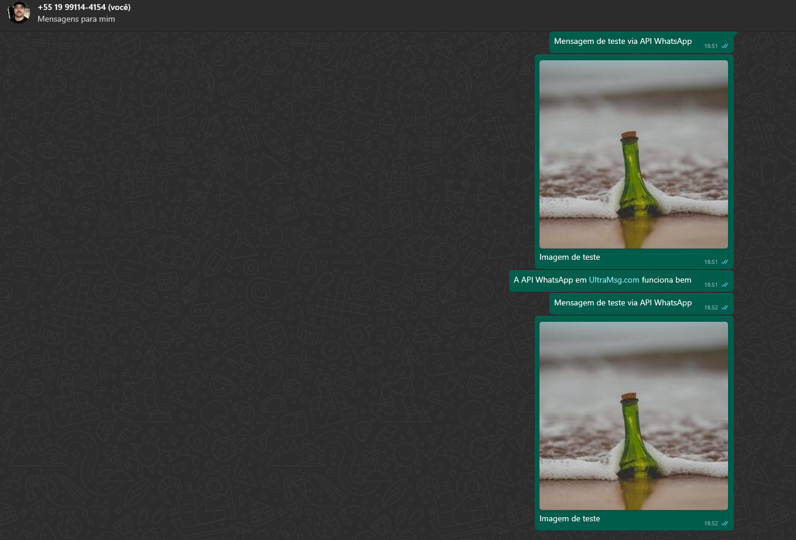

# API - Whats Message Controller
> Aplicação desenvolvida para estudo de aplicações com API do whatsapp e linguagem C#

## Funcionalidades
- Mandar mensagens apartir de um número para outro configurado no .ENV
- Tipos de mensagens:
    - Texto
    - Imagem
    - Video
    - Audio
    - Localização

## Estrutura do Projeto
/project
  /WhatsAppMessaging
    /Controllers
        - Controller.cs
    /Models
        - Message.cs
    /Services
        - WhatsAppService.cs
    /Utils
        - Config.cs
    /UI
        - MainForm.cs          
        - MainForm.Designer.cs 
    Program.cs

## Rodando o projeto

Compile o projeto

```bash
  dotnet build
```
Inicie o projeto

```bash
  dotnet run
```

## Autor

- [@femedici](https://github.com/femedici) 


> Listagem de Requests:


> Visualização no WhatsApp:
